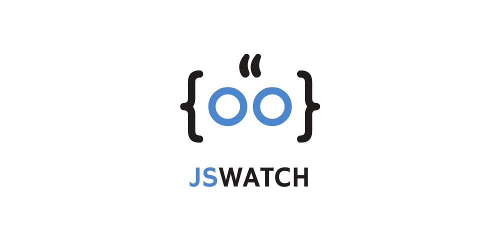

JSWatch is a lightweight and efficient JavaScript file monitoring tool that tracks changes in remote JavaScript files. It provides automatic diff generation, beautiful HTML/Markdown reports, and real-time monitoring capabilities.

## Features

- Real-time monitoring of remote JavaScript files
- Beautiful HTML and Markdown reports
- Detailed diff generation with context

## Installation

1. Clone the repository:

```bash
git clone https://github.com/yourusername/jswatch.git
cd jswatch
```

2. Install required dependencies:

```bash
pip install -r requirements.txt
```

3. Create `monitor.list` file

```text
https://example.com/test.js
https://example.com/analytic.js
```

4. Run Script

```bash
python main.py
```

## Project Structure 📁

```
jswatch/
├── main.py              # Main script
├── config.conf          # Configuration file
├── monitor.list         # URLs to monitor
├── utils/
│   ├── __init__.py
│   ├── downloader.py    # File download handler
│   ├── differ.py        # Diff generation
│   ├── reporter.py      # Report generation
│   └── helpers.py       # Utility functions
├── js_files/           # Downloaded JavaScript files
│   └── versions.json    # Version tracking
└── output.html         # Generated report
```

## Configuration ⚙️

### config.conf

```toml
# Directory to store downloaded JS files
storage_dir = "js_files"

# Check interval in minutes
check_interval_minutes = 60

# Logging level (DEBUG, INFO, WARNING, ERROR)
log_level = "INFO"

# Report format (markdown or html)
report_format = "html"

# Report output file
report_file = "output.html"

# Telegram Notification
telegram_api_key = ""
telegram_chat_id = ""
telegram_thread_id = ""
```

### monitor.list

Add URLs to monitor (one per line):

```
https://example.com/main.js
https://example.com/analytics.js
```

## Usage 💻

1. Set up your configuration:

   - Configure `config.conf` with your preferences
   - Add URLs to `monitor.list`

2. Run JSWatch:

```bash
python main.py
```

## Report Types

### HTML Report


### Markdown Report

Example:

````markdown
# JSWatch Report

Generated on: 2024-11-06 14:30:00

## example.com/main.js

Status: Changed
Time: 2024-11-06 14:30:00

```diff
+ New line added
- Old line removed
```
````

```

## Contributing 🤝

1. Fork the repository
2. Create your feature branch
3. Commit your changes
4. Push to the branch
5. Create a Pull Request

## License 📄

This project is licensed under the MIT License - see the [LICENSE](LICENSE) file for details.
```
